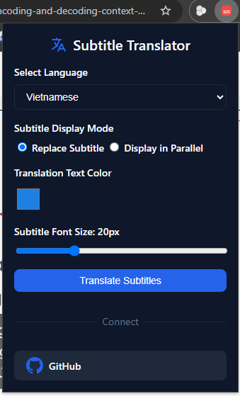
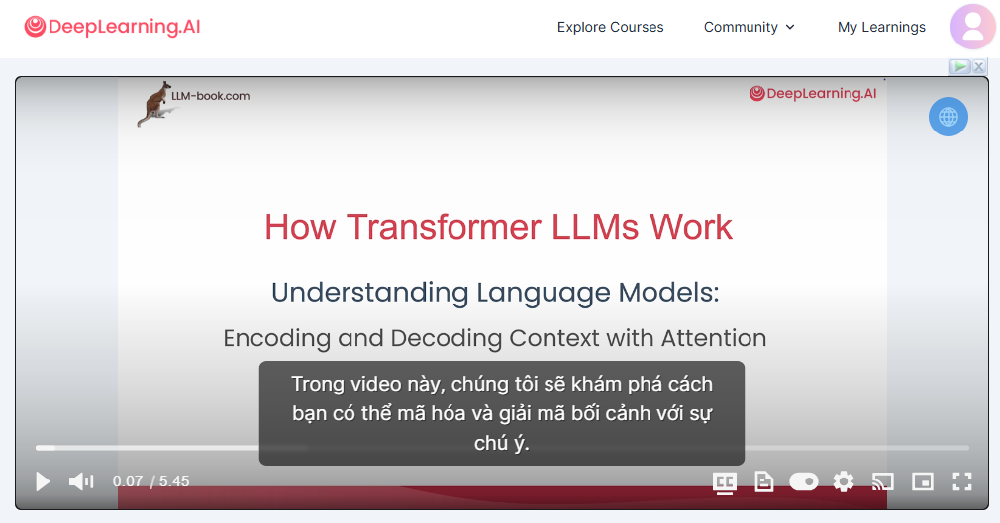

# Coursera & Deeplearning.ai Subtitle Translator

<div align="center">

</div>

This is a Chrome extension that translates English subtitles in Coursera and Deeplearning.ai courses into Vietnamese. It uses Google Translate API to provide quality translations and a better learning experience.

## ✨ Features

- 🌐 Support translation into Vietnamese
- 🎯 Support two online learning platforms:
      - Coursera.org
      - Deeplearning.ai
- ⚡ Real-time subtitle translation
- 🔄 Display sub: alternative or bilingual
- 💾 Cache translations to increase display speed
- 🎨 Integrated translation icon in video player: Easy to turn on/off translation function


## 🚀 Installation

1. Download source code:
```bash
git clone https://github.com/phatMT97/deeplearning-subtitle-translate.git
```

2. Open Chrome Extensions:
- Go to `chrome://extensions/`
- Enable "Developer mode" in the upper right corner

3. Install Extension:
- Click "Load unpacked"
- Select the folder containing the downloaded source code

## 📖 Instructions for use

1. Open the lecture video on Coursera or Deeplearning.ai

2. Open extension then click "Translate Subtitles" button

3. Find the icon 🌐 in the upper right corner of the video player

4. Click on the icon to enable/disable the translation function

5. The subtitles will be automatically translated

## Subtitle Font Size Option

You can now adjust the subtitle font size using the slider in the popup. The selected size will be applied to translate subtitles on the video player.

## 🛠️ Technology used

- Chrome Extension Manifest V3
- HTML/CSS
- JavaScript
- Google Translate API

## 📸 Illustration

### Extension Interface on Coursera


### Extension Interface on Deeplearning.ai


## 🤝 Contribute

All contributions are welcome! Feel free to:

- 🐛 Report a bug
- 💡 Suggest a new feature
- 🔧 Create a Pull Request

## 📝 License

This project is distributed under the MIT license. See `LICENSE` for more information.

## 💖 Support the project

If you find the project useful, please:
- ⭐ Star the project on GitHub
- 📢 Share with friends who are studying on Coursera or Deeplearning.ai
